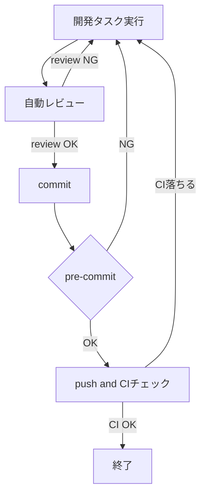
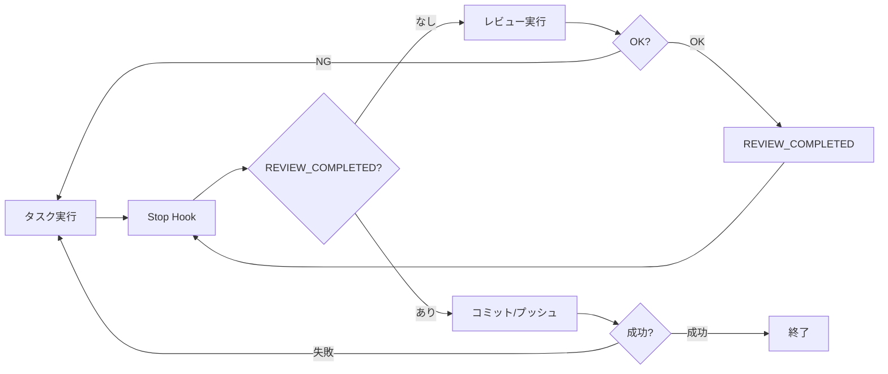

以前、以下のように Gemini CLI に自動レビューループさせる仕組みを作ったのですが、
https://zenn.dev/azumag/articles/a0d375832747fb
今回は Stop Hooks を連鎖させる仕組みを考えます。
通常 Hooks は並列実行ですが、工夫すると次のような逐次的な自動ワークフローを構築することができます:



基本的に Bypassing Permissions での利用を想定しています。やろうと思えば CIのチェックが終わった後に Issue を Github から取得してその内容をフィードバックすることで、**無限開発ループを作ることも可能です。** もちろん、現状の Claude Code での開発は、規模が大きくなるほど人の手による QA が必須になってきますが、このような仕組みを作る技術的な試みは面白いと思います。

実際のところ、こんなことしなくてもそのうち本家に workflow 的な機能が実装されるのではなと思ってますが、どれだけの人がこんな使い方をしたいかはわかりません。（私はめっちゃ欲しかった）

:::message
終了条件フレーズ（合言葉）を利用して連鎖させるため、意図しない動作やループが発生する可能性はあり、複雑な合言葉を利用したり、Hook スクリプト側での状態管理を行うなど適宜工夫を行う必要があります。
:::

# 仕組み

## decision block の利用
Hooks には呼び出した後のアウトプットに終了コードを返すことで、それがエラー終了なのか正常終了なのかを Claude に返すことができます。終了コードだけでなく、JSON を返すこともでき、以下の様に「ブロック」する指示 `{"decision": "block"}` を指定した場合、`reason` の中身を Claude が解釈して再実行してくれます。これは Stop Hook でも有効です。
```json
{
  "decision": "block",
  "reason": "レビュー：ハードコードが複数箇所に存在するので、定数化すること"
}
```
これを利用してレビュー結果などを claude に伝えますが、この際に `reason` に条件分岐を入れ、終了条件としてのキーフレーズを指定します。

## 終了条件指定と連鎖
タスクの終了条件を満たした場合に **終了条件フレーズ** を出力するように `reason` での指示を行います。hooks は起動された時の会話ログから終了条件フレーズをチェックし、処理の継続/終了を判定するようにすることで、作業のループから抜けます。
終了条件が機械的に判定できる場合（commit等）は exit 0 で終わってプロセス終了してもよいですが、後続にタスクを連鎖させたい場合はフレーズの出力が必須になります。
連鎖させる場合、**前段のタスクの終了条件フレーズを開始のキーとする**スクリプトを作成し、stop hooks で起動します。

終了条件フレーズの取得・判定はたとえば以下のようにします（後述の kazuph さんによるHooks に関する記事を参考にしています。ありがとうございます。）
```bash
#!/bin/bash

set -euo pipefail

INPUT=$(cat)

TRANSCRIPT_PATH=$(echo "$INPUT" | jq -r '.transcript_path')
if [ -f "$TRANSCRIPT_PATH" ]; then
    LAST_MESSAGES=$(tail -n 100 "$TRANSCRIPT_PATH" | \
        jq -r 'select(.type == "assistant") | .message.content[]? |　select(.type == "text") | .text' 2>/dev/null | tail -n 1)

    # REVIEW_COMPLETED が含まれているときのみ実行
    if [ -n "$LAST_MESSAGES" ] && echo "$LAST_MESSAGES" | grep -q "REVIEW_COMPLETED"; then
        # 実行したいタスク、あるいは cat で json を用いて claude に指示
        cat '{"decision": "block", "reason": "please commit & push all changes"}'
    fi
    exit 0
else
    exit 0
fi
```

:::message
終了条件フレーズの出力は LLM に任されているため、意図しない無限ループになる可能性があります。今の所 フレーズの出力を間違えて無限ループに陥るなどは起こっていないですが、安全を考えるならば .stop_hook_active を使ったりループカウントするなど、Hooks で呼ぶスクリプト側に安全脱出機構は備えておくべきかもしれません。
:::

## 連鎖の例
例として、claude に sub agent を用いて自己レビューさせ[^1]、それが通ったら commit push することを考えましょう。

[^1]: SubAgentにレビューを頼めば、その終了後に起動されるフックはSubagentStopHookなので、ループを気にせず気軽に呼び出すことができます。Gemini呼び出すより楽ですが、同じClaudeへの忖度なのかGeminiよりレビューが甘いです。https://zenn.dev/articles/62e76863440e4b/edit

### 起点Hook
`reason` に以下の内容が入る json を出力するスクリプトを stop hook に設定します。
```
Sub Agent に作業内容をレビューしてもらい、レビュー内容に従って修正せよ。
これ以上の改善点は特に無しとレビューを得た時のみ「REVIEW_COMPLETED」とだけ発言せよ。
```
このスクリプトの起動条件は特にないので、実作業終了後常にこれが起動することになります。これを「**起点Hook**」とします。またこの `REVIEW_COMPLETED` を終了条件フレーズとしているので、起点Hookでは起動時に `REVIEW_COMPLETED` なら即終了する処理を入れておきます。

### 後続Hook
もう一つ、commit push するフックを stop に設定します。これは `REVIEW_COMPLETED` 以外の会話であれば即終了し、`REVIEW_COMPLETED` の表示があった時のみ処理を実行するようにします。簡単化のため、claude に直接依頼します
```
- 作業ディレクトリにおいて、commit していないファイルがあればコミットし、push せよ
- すべて push 済みならば、PUSH_COMPLETED とだけ発言せよ
```
ここでの終了条件は `PUSH_COMPLETED` ですが、この後続はないので、**終点Hook** になります。終点Hookの場合はそのまま exit 0 で終了してしまっても問題ありません。

### 動作
1) タスク実行
2) タスクが終わると Stop Hook に設定した起点フックと後続フックが両方起動される。この時点では、`REVIEW_COMPLETED`は会話ログにないので、起点フックのレビューだけが処理を続行
3) レビュー結果が思わしくなかった場合は claude がreasonを見てタスク実行(1)に戻る。レビューOKなら `REVIEW_COMPLETED` 表示
4) Stop に設定してある起点フックと後続フックがまた両方起動される。`REVIEW_COMPLETED`なので、後続フックだけが処理を続行
5) コミットとプッシュが行われる。正常終了しなければ reason をみてタスク実行(1)に戻る。正常終了すれば処理を終了


# 実装例
最初に提示したワークフローを作ってみたのが置いてあります。Geiminiでの自動レビューを作ったのと同じところに置いたのでちょっとわかりづらいですが、オプショナルなフックとして置いてあります。 README 参照のこと。
https://github.com/azumag/cc-gc-review

# Reference
元となったアイディア 本当に素晴らしい！ありがとうございました。
https://zenn.dev/kazuph/articles/483d6cf5f3798c